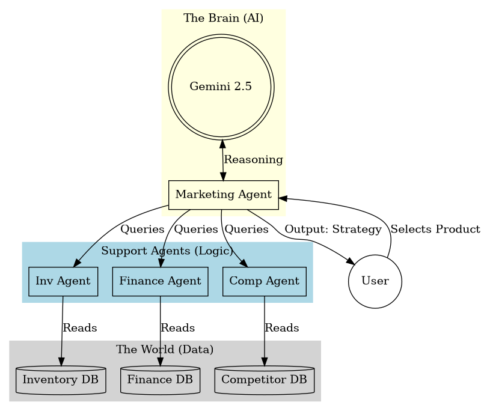

# 🚀 Autonomous Marketing Agent for MSMEs

> **Intelligence-Driven Decisions, Not Just Ads.**

A powerful AI-driven dashboard designed to help Micro, Small, and Medium Enterprises (MSMEs) make smarter marketing decisions. Instead of blindly running ads, this agent analyzes your **Finance, Inventory, and Competitor** data to recommend the *right* strategy—whether it's launching a campaign, clearing dead stock, or holding cash during a crisis.



## 🌟 Key Features

*   **🧠 Multi-Agent Core**:
    *   **Finance Agent**: Monitors cash flow and burn rate. Warns if you're running out of money.
    *   **Inventory Agent**: Identifies "Dead Stock" (Overstock) and "Scarcity" (Low Stock) risks based on 7-day sales velocity.
    *   **Competitor Agent**: Real-time price comparison to see if you are winning or losing the price war.
    *   **Audit Agent**: "Blockchain-lite" logging system that records every AI decision for transparency and compliance.

*   **🚨 Crisis Simulation Mode**:
    *   One-click "Simulate Market Crash" button.
    *   Forces the AI to switch from "Growth" to "Survival" mindset (e.g., recommends liquidation instead of ad spend).

*   **⚡ Automated Actions**:
    *   **One-Click Reorder**: Drafts emails to vendors for low-stock items.
    *   **Ad Launch Simulation**: Simulates connecting to Meta Ads Manager to launch campaigns.
    *   **Clearance Sale**: Auto-generates discount strategies for overstocked items.

## 🛠️ Installation

### Prerequisites
*   Python 3.8+
*   A Google Cloud Project with Gemini API access.

### 1. Clone & Setup
```bash
git clone https://github.com/yourusername/msme-agent.git
cd msme-agent
python3 -m venv venv
source venv/bin/activate  # On Windows: venv\Scripts\activate
```

### 2. Install Dependencies
```bash
pip install -r requirements.txt
```

### 3. Configure API Key
Open `marketing_agent.py` and paste your Google Gemini API Key:
```python
# marketing_agent.py
API_KEY = "YOUR_GEMINI_API_KEY_HERE"
```

## 🚀 Usage

Run the Streamlit dashboard:

```bash
streamlit run app.py
```

1.  **Dashboard Overview**: Check your Cash Runway, Inventory Health, and Competitor Pressure at a glance.
2.  **Select a Product**: Choose a product from the dropdown to analyze its specific metrics.
3.  **Generate Strategy**: Click **"GENERATE STRATEGY"** to let the Gemini AI process all data points and give you a specific action plan.
4.  **Execute**: Use the provided buttons to "Launch Ads" or "Send Email Blasts" based on the advice.

## 📂 Project Structure

*   `app.py`: Main Streamlit dashboard application.
*   `marketing_agent.py`: The brain of the system. Connects to Gemini AI and orchestrates other agents.
*   `agents.py`: Contains the logic for specific domain agents (Finance, Inventory, Competitor, Audit).
*   `data/`: (Simulated with CSVs)
    *   `inventory.csv`: Product stock and pricing.
    *   `sales_history.csv`: Historical sales data for trend analysis.
    *   `financials.csv`: Cash balance and burn rate.
    *   `competitors.csv`: Competitor pricing data.

## 🤖 Tech Stack

*   **UI**: [Streamlit](https://streamlit.io/)
*   **AI**: [Google Gemini 2.5 Flash](https://deepmind.google/technologies/gemini/)
*   **Data Vis**: [Plotly Express](https://plotly.com/python/)
*   **Data Processing**: [Pandas](https://pandas.pydata.org/)

---
*Built for the Future of MSME Intelligence.*